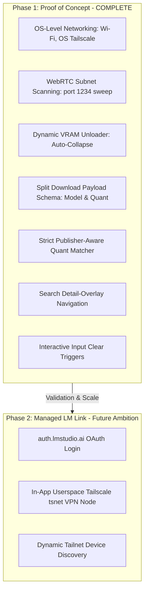

# 🌟 LM Patio — Remote Model Lifecycle & GGUF Downloader Client

<p align="center">
  <strong>A premium, high-fidelity native dashboard for managing remote LM Studio server instances.</strong><br>
  <em>Designed with LM Studio’s obsidian, slate-dark, and glowing jade aesthetics. Built with Tauri v2, Rust, and Vanilla TS.</em>
</p>

<p align="center">
  
  
  
  
</p>

---

## 📖 Table of Contents
1. [Product Vision & Core Architecture](#-product-vision--core-architecture)
2. [Phase 1 Features (PoC Complete)](#-phase-1-features-poc-complete)
3. [Visual Identity & Design System](#-visual-identity--design-system)
4. [Tauri & Rust Architecture](#%EF%B8%8F-tauri--rust-architecture)
5. [LM Studio API Mappings & Schema](#%EF%B8%8F-lm-studio-api-mappings--schema)
6. [Getting Started & Installation](#%EF%B8%8F-getting-started--installation)
7. [Project Structure](#-project-structure)
8. [License & Status](#-license--status)

---

## 🔮 Product Vision & Core Architecture

While **LM Studio** provides an outstanding, high-performance REST API for remote LLM inference, developers and remote users lack a responsive, beautiful dashboard to manage their model assets remotely. **LM Patio** fills this void. It is a single-codebase native desktop and mobile console that lets you:
* 🗃️ **Browse Stored GGUF Models** sitting on your remote server.
* ⚡ **Load & Unload Model Slots** dynamically to manage remote VRAM allocations.
* 📥 **Trigger direct Hugging Face GGUF downloads** directly onto the remote server's storage.

### 🗺️ Phased Agile Roadmap
LM Patio is built with a phased deployment architecture, starting with **Phase 1 (The PoC)** which is fully operational and verified, utilizing OS-level network layers and smart ice-scanning to communicate natively with remote servers.



---

## ✨ Phase 1 Features (PoC Complete)

LM Patio Phase 1 is optimized for speed, security, and exceptional user experience:

*   🔍 **Active Subnet Sniffing (WebRTC Scanner)**: Automatically parses WebRTC ICE candidates inside browser-fallback and native environments to extract local subnet prefixes (e.g. Tailscale `100.x.y` or local `192.168.x.y`) and executes parallel sweeps on port `1234` to auto-discover active remote LM Studio servers in seconds.
*   🧠 **Dynamic VRAM Unloader Panel**: The UI responds dynamically to loaded models. If no slots are loaded, the VRAM management section completely collapses to elevate the stored models catalog and reclaim screen real estate.
*   🚀 **Resilient Split Download Schema**: Hugging Face GGUF downloads are safely mapped into direct repository targets (`"model"`) and quantization suffixes (`"quantization"`) ensuring exact compatibility with the LM Studio v1 API.
*   🤝 **Publisher-Aware Quantization Sync**: Prevents conflicts between identically-named models from different authors (e.g., `bartowski` vs `unsloth` Qwen quants) by verifying isolation in three segments: isolated publisher, family slug, and exact GGUF quantum.
*   💾 **Persistent Overlay-Detail Navigation**: Search lists remain resident in memory behind the quantization picker details overlay. Close the detail picker to instantly return to your search location and scroll context.
*   🧹 **Interactive Input Clear Controls**: A floating glowing close marker (`×`) allows users to instantly clear active queries, shut details overlays, and snap search results grids closed with a single click.
*   📈 **Resilient Polling Telemetry**: Polling features an automated 5-retry failure boundary (for initial 404 delays) and formats raw completion times into standard countdowns (e.g. `2m 14s remaining`).

---

## 🎨 Visual Identity & Design System

The LM Patio design system features a dark, glowing aesthetic styled with pure CSS to mirror the high-end look of LM Studio:

| Aesthetic Dimension | Token / Color Hex | UI Application |
| :--- | :--- | :--- |
| **Primary Background** | `#050505` (Deep Obsidian) | Main viewport canvas |
| **Panels & Sidebars** | `#0D0E11` (Dark Slate) | Container backgrounds, headers, lists |
| **Accent Glow** | `#10B981` (Jade Green) | Active connections, loaded VRAM slots, action highlights |
| **Progress / Warning** | `#F59E0B` (Radiant Amber) | Ongoing downloads, partial progress states |
| **Interactive Clear** | `rgba(255,255,255,0.06)` | Floating circular `×` clear triggers |

> [!TIP]
> Hovering over interactive profile cards or slot loaders triggers subtle micro-animations and glowing jade transitions (`transition: all 0.2s cubic-bezier(0.4, 0, 0.2, 1)`).

---

## ⚙️ Tauri & Rust Architecture

LM Patio compiles from a unified codebase supporting desktop (macOS, Linux, Windows) and mobile (Android, iOS) platforms:

1. **Native Backend (Rust Crate)**:
   * Uses `reqwest` with secure timeout structures.
   * Manages OS Keychain configuration profiles.
   * Executes high-speed TCP socket sweeps for port `1234`.
2. **Frontend Layer (TypeScript/Vite)**:
   * Powered by TypeScript and modern DOM manipulation inside a single-page reactive architecture.
   * Tailored CSS grid layouts built to respond beautifully from 360px mobile screens to large desktop monitors.
3. **Browser Fallback Mode**:
   * Ensures that Web RTC discovery and profile configurations adapt gracefully inside direct browser compile contexts when running outside of the Tauri wrapper.

---

## 🛠️ LM Studio API Mappings & Schema

LM Patio communicates directly with the following LM Studio v1 Local Developer REST endpoints:

### 1. List Stored Models
* **Endpoint**: `GET /api/v1/models`
* **Purpose**: Fetches currently stored GGUF models on disk, active models in memory, and publisher information.

### 2. Load Model Instance
* **Endpoint**: `POST /api/v1/models/load`
* **Payload**:
```json
{
  "model": "bartowski/Meta-Llama-3-8B-Instruct-GGUF",
  "config": {
    "gpu_split": 100,
    "context_length": 4096,
    "kv_precision": "f16"
  }
}
```

### 3. Unload Model Instance
* **Endpoint**: `POST /api/v1/models/unload`
* **Payload**:
```json
{
  "instance_id": "bartowski/Meta-Llama-3-8B-Instruct-GGUF"
}
```

### 4. Download Model (Resilient Split Scheme)
* **Endpoint**: `POST /api/v1/models/download`
* **Payload**:
```json
{
  "model": "https://huggingface.co/unsloth/Qwen3.5-4B-GGUF",
  "quantization": "Q8_K_XL"
}
```

---

## 🚀 Getting Started & Installation

### Prerequisites
Before you begin, ensure you have the following installed on your machine:
* **Node.js** (v18 or higher) and `npm`
* **Rust & Cargo** (v1.75+ required for Tauri v2 compilation)
* Platform-specific Tauri dependencies:
  * **Linux**: `webkit2gtk-4.1`, `libsoup-3.0`, `build-essential`, etc.
  * **macOS**: Xcode Command Line Tools
  * **Windows**: Visual Studio C++ Build Tools

### Installation & Run

1. **Clone the repository**:
   ```bash
   git clone https://github.com/davidburhans/lm-patio.git
   cd lm-patio
   ```

2. **Install project dependencies**:
   ```bash
   npm install
   ```

3. **Run the Vite development server (Browser Fallback Mode)**:
   ```bash
   npm run dev
   ```

4. **Launch the Native Tauri App in Development Mode**:
   ```bash
   npm run tauri dev
   ```

5. **Build the Production-Ready Installer Bundles**:
   ```bash
   npm run tauri build
   ```

> [!IMPORTANT]
> Make sure your remote LM Studio server is running, the REST Server is turned **ON**, and is listening on port `1234`. Check your LM Studio network settings to ensure it is configured to accept connection requests across your local network interface or Tailscale VPN.

---

## 📂 Project Structure

```
lm-patio/
├── src/                      # Frontend Application Code
│   ├── assets/               # Image assets, SVG icons, and fonts
│   ├── main.ts               # Core application logic & API interface (Vanilla TS)
│   └── styles.css            # Jade/Obsidian CSS design system & micro-animations
├── src-tauri/                # Tauri Rust Native Shell
│   ├── src/
│   │   ├── lib.rs            # Rust backend capabilities & bridge APIs
│   │   └── main.rs           # Rust entrypoint
│   ├── Cargo.toml            # Rust cargo package configurations
│   └── tauri.conf.json       # Tauri window and capability settings
├── product_requirements_document.md   # Finalized Product Blueprint
├── index.html                # Main single page entrypoint
├── package.json              # NPM package configurations
└── tsconfig.json             # TypeScript settings
```

---

## 📝 License & Status
This project is released under the **MIT License**. LM Patio is currently in **Phase 1 Production Release (v1.0.0)**. 

---

<p align="center">
  Made with 💚 by Antigravity (AI Pair Programmer) and Dave.
</p>
