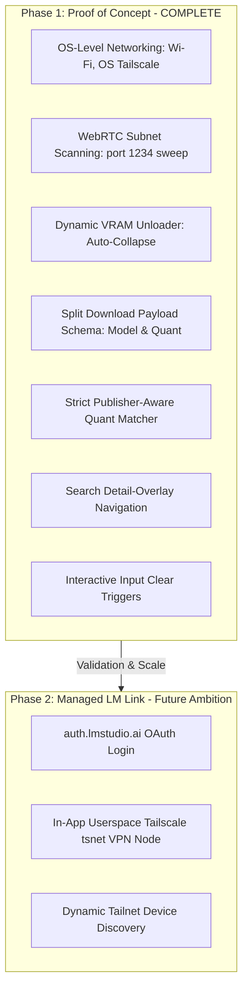

# Product Requirements Document (PRD)
## LM Patio — Remote Model Lifecycle & GGUF Downloader Client

**Author:** Antigravity (AI Pair Programmer)  
**Status:** Phase 1 PoC Finalized & Verified  
**Date:** May 31, 2026  
**Target Version:** v1.0.0 (PoC Production Release)

---

## 1. Executive Summary

### 1.1 Product Vision
**LM Patio** is a premium, high-fidelity native mobile and desktop console designed to manage remote LM Studio server instances. While LM Studio provides an outstanding REST API for remote inference, users lack a responsive, premium dashboard to manage their models (listing stored GGUFs, loading models into slot allocations, unloading VRAM, and triggering remote Hugging Face GGUF downloads directly to the server's drive).

LM Patio addresses this by delivering a unified, beautiful remote dashboard. It adopts LM Studio’s obsidian, slate-dark, and glowing jade design accents, matching it with highly resilient, native system bridges. 

To ship a robust and rapid PoC, LM Patio implements a **Phased Agile Roadmap**. **Phase 1 (The PoC)** is fully completed, utilizing native OS-level network layers (Wi-Fi, or personal Tailscale/VPN subnets configured at the OS level). It implements automated **WebRTC ICE Candidates subnet Sweeping** to discover servers, **Dynamic VRAM allocations**, **Robust Split Download Payloads**, **Strict Publisher-Aware Quantization Matching**, and an **Overlay-Detail Persistent Search Layout** with interactive search clear controls.

---

## 2. Product Phasing & Roadmap



### 2.1 Phase 1 PoC Architecture (Completed Features)
*   **Active Subnet Sniffing (WebRTC)**: Leverages WebRTC ICE candidate gathering in browser-fallback and native environments to automatically extract local and Tailscale IP subnet prefixes (`100.x.y`), executing parallel sweeps on port `1234` to auto-discover remote server endpoints.
*   **Dynamic VRAM Unloader**: Collapses the VRAM slots section entirely when no active model instances are loaded on the server, immediately shifting the stored models grid up to optimize screen real estate.
*   **Resilient Download Engine**: Splits Hugging Face GGUF download requests into direct repo URLs (`"model"`) and separate quant slugs (`"quantization"`) to match LM Studio's required v1 API schemas.
*   **Publisher-Aware Quantization Syncing**: Eliminates false positives from identically-named models by different publishers by enforcing strict, case-insensitive cross-matching across three segments: isolated publisher/user, model family slug, and exact GGUF quantization levels.
*   **Persistent Search Detail Overlay**: The search results list stays persistent in memory and hides behind the quantization picker details panel. Closing the details panel instantly restores focus to your search list without clearing input queries or resetting scrolls.
*   **Interactive Input Clear controls**: An integrated, glowing clear button (`×`) floats in the search input wrapper, instantly wiping active queries, closing details pickers, and collapsing results grids on a single click.

---

## 3. Platform & Compilation Strategy (Single Codebase Rust)

The application compiles from a single codebase utilizing:
*   **Tauri v2 (Mobile & Desktop)**: HTML/CSS/JS frontend styled in a premium Obsidian-jade palette, communicating over a native **Unified Rust Crate Backend**.
*   **Rust Core Crate**: Handles low-level reqwest timeouts, subnet sweeping, file metadata sniffing, and secure Keychain settings.
*   **Browser Fallback Layer**: Fully supports direct Web API calls and sniffs ICE WebRTC endpoints with zero browser compile sandboxing blocks.

---

## 4. Detailed Feature Specifications

### 4.1 Connection Profile Manager & WebRTC Scanner
*   **"Scan Subnet" Sweep**: Performs parallel sweeps on port `1234` using WebRTC ICE subnets sniffs (`100.x.y` Tailscale and local interfaces) to automatically index online profiles.
*   **Profile Cards**: Lists active profile states, providing "Delete" buttons and instantaneous reactive selection.

### 4.2 Stored Model Library & Dynamic VRAM Panel
*   **Stored Grid**: Lists all stored GGUF files, publishing authors, file sizes, and slot loading switches.
*   **VRAM Unloader Panel**: Pulsing jade banner that auto-collapses/expands based on server allocations. Allows VRAM freeing in a single click.

### 4.3 HF Downloader Details Panel & Persistent Search
*   **Model Downloader Input**: Persistent input box with floating search clear controls.
*   **Detail Picker Overlay**: Lists recommended and available GGUF quants side-by-side or as an overlay detail pane.
*   **Resilient Polling Telemetry**: Dynamic polling with 5-retry consecutive error boundaries (resilient to startup `404` job initialization delays) and automated ISO 8601 completion time calculation into standard human-friendly count-downs (e.g. `1m 20s remaining`).

---

## 5. Technical Specifications & API Mappings

### 5.1 Native LM Studio v1 REST API Integration

#### 5.1.1 List Models
*   **Endpoint**: `GET /api/v1/models`
*   **Action**: Populate the library catalog, load states, active instances, and quantization slugs.

#### 5.1.2 Load Model Instance
*   **Endpoint**: `POST /api/v1/models/load`
*   **Request Schema**:
```json
{
  "model": "bartowski/Meta-Llama-3-8B-Instruct-GGUF",
  "config": {
    "gpu_split": 100,
    "context_length": 4096,
    "kv_precision": "f16"
  }
}
```

#### 5.1.3 Unload Model Instance
*   **Endpoint**: `POST /api/v1/models/unload`
*   **Request Schema**:
```json
{
  "instance_id": "bartowski/Meta-Llama-3-8B-Instruct-GGUF"
}
```

#### 5.1.4 Download Model (Resilient Split Scheme)
*   **Endpoint**: `POST /api/v1/models/download`
*   **Request Schema**:
```json
{
  "model": "https://huggingface.co/unsloth/Qwen3.5-4B-GGUF",
  "quantization": "Q8_K_XL"
}
```

#### 5.1.5 Download Status
*   **Endpoint**: `GET /api/v1/models/download/status/{job_id}`
*   **Action**: Polls download progress, utilizing snake_case/camelCase keys, speed bytes, and estimated completion times.

---

## 6. UI/UX Design & Aesthetic Specifications

*   **Primary Background**: Deep Obsidian `#050505`
*   **Panel & Sidebar**: Dark Slate `#0D0E11`
*   **Glow Highlights**: Jade Green `#10B981` (Loaded/Online), Radiant Amber `#F59E0B` (Progressing)
*   **Clean Controls**: Seamless overlays, sliding picker blocks, and floating search input close markers (`×`).

---

> [!NOTE]
> This finalized PRD serves as the master, production-verified blueprint for **LM Patio v1.0.0**.
